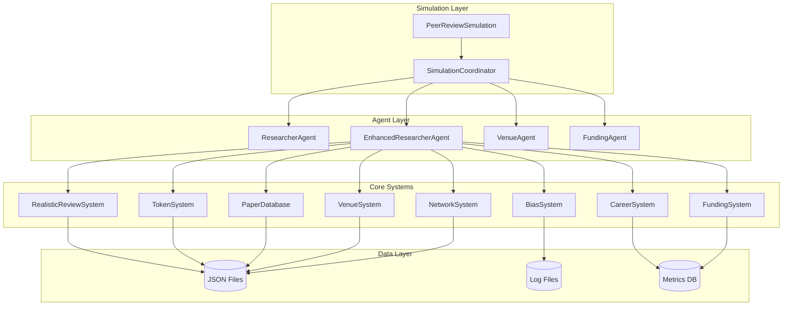

# Design Document

## Overview

This design document outlines the comprehensive enhancement of the existing peer review simulation system. The current system has basic multi-agent capabilities with token-based incentives and some realistic review features. This enhancement will transform it into a sophisticated simulation that accurately models the complexities of academic peer review across three phases:

1. **Core Realism Improvements**: Enhanced review system, researcher hierarchy, venue system, and temporal dynamics
2. **Advanced Behavioral Modeling**: Cognitive biases, social networks, and strategic behaviors  
3. **Ecosystem Dynamics**: Funding integration, career progression, and meta-science elements

The design leverages the existing AutoGen multi-agent framework, PaperDatabase, TokenSystem, and basic RealisticReviewSystem components while significantly expanding their capabilities.

## Architecture

### High-Level Architecture



### Component Architecture

The system follows a modular architecture where each major enhancement area is implemented as a separate system that integrates with the existing core components:

- **Enhanced Researcher Agents**: Extended with hierarchy, reputation, biases, and career progression
- **Venue System**: Manages different publication venues with realistic characteristics
- **Network System**: Models social and collaboration networks
- **Bias System**: Implements cognitive biases affecting review decisions
- **Career System**: Tracks career progression and associated pressures
- **Funding System**: Models funding cycles and resource constraints

## Components and Interfaces

### 1. Enhanced Review System

**Purpose**: Extends the existing RealisticReviewSystem with comprehensive multi-dimensional scoring and structured feedback to meet the six-dimensional scoring requirements and venue-specific standards.

**Design Rationale**: The enhanced review system addresses Requirement 1 by implementing mandatory scoring across all six dimensions (novelty, technical quality, clarity, significance, reproducibility, related work) with 1-10 scales, enforcing venue-specific minimum word counts (300-1000 words), and requiring structured sections including summary, strengths, weaknesses, detailed comments, and questions for authors.

**Key Classes**:
- `EnhancedReviewCriteria`: Implements the six mandatory scoring dimensions with 1-10 scales
- `StructuredReview`: Enforces required sections (summary, minimum 2 strengths, minimum 1 weakness, detailed comments, questions for authors)
- `ReviewQualityValidator`: Validates reviews meet venue-specific standards including word count requirements
- `ConfidenceLevelTracker`: Manages 1-5 confidence levels and recommendation categories (Accept, Minor Revision, Major Revision, Reject)

**Interface**:
```python
class EnhancedReviewSystem(RealisticReviewSystem):
    def validate_six_dimensional_scoring(self, review: StructuredReview) -> bool
    def enforce_venue_word_requirements(self, review: StructuredReview, venue: Venue) -> bool
    def validate_structured_sections(self, review: StructuredReview) -> bool
    def validate_confidence_and_recommendation(self, review: StructuredReview) -> bool
    def calculate_weighted_score(self, reviews: List[StructuredReview]) -> float
    def generate_review_feedback(self, review: StructuredReview) -> ReviewFeedback
    def track_review_quality_metrics(self, reviewer_id: str, review: StructuredReview)
```

### 2. Researcher Hierarchy System

**Purpose**: Manages academic hierarchy, reputation metrics, and career progression to model realistic academic power dynamics.

**Design Rationale**: This system addresses Requirement 2 by implementing six distinct seniority levels (Graduate Student, Postdoc, Assistant Prof, Associate Prof, Full Prof, Emeritus) with reputation scores calculated from h-index, total citations, years active, and institutional tier (1-3). Full Professors receive 1.5x influence multiplier compared to Assistant Professors baseline, and the system maintains comprehensive review history including quality scores and reliability metrics.

**Key Classes**:
- `AcademicHierarchy`: Manages the six seniority levels and progression rules
- `ReputationCalculator`: Computes reputation scores from h-index, citations, years active, and institutional tier
- `CareerTracker`: Tracks career milestones, review quality history, and reliability metrics
- `InfluenceMultiplierManager`: Applies reputation-based multipliers (1.5x for Full Professors vs Assistant baseline)

**Interface**:
```python
class AcademicHierarchy:
    def assign_seniority_level(self, researcher: EnhancedResearcher) -> ResearcherLevel
    def calculate_reputation_score(self, h_index: int, citations: int, years_active: int, institution_tier: int) -> float
    def calculate_reputation_multiplier(self, researcher: EnhancedResearcher) -> float
    def track_review_quality_history(self, reviewer_id: str, review_quality: float, reliability: float)
    def get_promotion_requirements(self, current_level: ResearcherLevel) -> Dict
    def apply_career_pressure(self, researcher: EnhancedResearcher) -> CareerPressure
    def update_institutional_influence(self, researcher: EnhancedResearcher)
```

### 3. Venue Management System

**Purpose**: Manages publication venues with realistic characteristics and standards to model the academic publishing landscape.

**Design Rationale**: This system addresses Requirement 3 by implementing six distinct venue types with realistic acceptance rates: Top Conference (5%), Mid Conference (25%), Low Conference (50%), Top Journal (2%), Specialized Journal (15%), and General Journal (40%). Each venue type enforces specific review standards, minimum reviewer counts (2-3), and acceptance thresholds ranging from 5.0/10 for low conferences to 8.5/10 for top journals.

**Key Classes**:
- `VenueRegistry`: Central registry managing all six venue types with their specific characteristics
- `VenueStandardsEnforcer`: Enforces venue-specific requirements including review lengths and detailed scores
- `AcceptanceRateManager`: Manages dynamic acceptance rates and thresholds per venue type
- `ReviewerAssignmentManager`: Prefers higher reputation reviewers for top-tier venues

**Interface**:
```python
class VenueSystem:
    def register_venue(self, venue: EnhancedVenue, venue_type: VenueType) -> bool
    def assign_reviewers_by_venue_tier(self, submission: Submission, venue: EnhancedVenue) -> List[str]
    def calculate_venue_specific_threshold(self, venue: EnhancedVenue) -> float
    def enforce_venue_review_standards(self, review: StructuredReview, venue: EnhancedVenue) -> bool
    def get_minimum_reviewer_count(self, venue_type: VenueType) -> int
    def validate_acceptance_threshold(self, venue: EnhancedVenue, score: float) -> bool
    def track_venue_statistics(self, venue_id: str) -> VenueStats
```

### 4. Temporal Dynamics Manager

**Purpose**: Handles realistic timing constraints, deadlines, and workflow management to capture temporal pressures and delays of real peer review.

**Design Rationale**: This system addresses Requirement 4 by implementing realistic review deadlines ranging from 2-8 weeks based on venue type, tracking late submissions with penalties to reviewer reliability scores, considering reviewer workload with maximum reviews per month (2-8 based on seniority), and supporting multi-round revision cycles with updated deadlines and re-review processes.

**Key Classes**:
- `DeadlineManager`: Manages venue-specific review deadlines (2-8 weeks) and late submission penalties
- `WorkloadTracker`: Tracks reviewer availability, current workload, and maximum reviews per month by seniority
- `RevisionCycleManager`: Manages multi-round review processes with updated deadlines
- `ReliabilityScoreManager`: Applies penalties for late submissions and tracks reviewer reliability

**Interface**:
```python
class TemporalDynamicsManager:
    def set_venue_specific_deadline(self, submission_id: str, venue: EnhancedVenue) -> datetime
    def check_reviewer_workload_capacity(self, reviewer_id: str, seniority: ResearcherLevel) -> bool
    def apply_late_submission_penalty(self, reviewer_id: str, days_late: int) -> float
    def manage_revision_cycle(self, paper_id: str, decision: ReviewDecision) -> RevisionCycle
    def get_maximum_reviews_per_month(self, seniority: ResearcherLevel) -> int
    def track_reviewer_reliability(self, reviewer_id: str, on_time: bool) -> float
    def calculate_venue_deadline_weeks(self, venue_type: VenueType) -> int
```

### 5. Cognitive Bias System

**Purpose**: Models realistic cognitive biases affecting review decisions to enable analysis of bias effects on review outcomes and fairness.

**Design Rationale**: This system addresses Requirement 5 by implementing four key cognitive biases: confirmation bias (0-1 strength) where reviewers favor papers aligning with their research beliefs, halo effect bias increasing scores by 0-2 points based on author reputation and reviewer prestige bias (0-1), anchoring bias where later reviewers are influenced by earlier review scores, and availability bias affecting judgment based on recent paper exposure.

**Key Classes**:
- `BiasEngine`: Central engine coordinating all bias applications with configurable strength parameters
- `ConfirmationBiasModel`: Models confirmation bias with 0-1 strength based on research belief alignment
- `HaloEffectModel`: Models prestige-based bias with 0-2 point score adjustments based on author reputation
- `AnchoringBiasModel`: Models anchoring effects where later reviews are influenced by earlier scores
- `AvailabilityBiasModel`: Models bias based on recent exposure to similar work

**Interface**:
```python
class CognitiveBiasSystem:
    def apply_confirmation_bias(self, reviewer: EnhancedResearcher, paper: Paper, bias_strength: float) -> float
    def apply_halo_effect(self, reviewer: EnhancedResearcher, authors: List[str], prestige_bias: float) -> float
    def apply_anchoring_bias(self, current_review: Review, previous_reviews: List[Review]) -> float
    def apply_availability_bias(self, reviewer: EnhancedResearcher, paper: Paper, recent_exposure: List[Paper]) -> float
    def calculate_bias_adjusted_score(self, base_score: float, biases: List[BiasEffect]) -> float
    def configure_bias_strengths(self, reviewer: EnhancedResearcher) -> Dict[str, float]
    def track_bias_effects(self, review: StructuredReview, applied_biases: List[BiasEffect])
```

### 6. Social Network System

**Purpose**: Models academic social networks and their influence on peer review to capture collaborative relationships and community dynamics.

**Design Rationale**: This system addresses Requirement 6 by implementing conflict of interest detection for co-authors, advisors, and recent collaborators within 3 years, modeling collaboration networks where closer connections have reduced review weight, tracking citation networks with citation-based bias effects, and simulating conference communities with regular attendee networks and clique formation affecting reviewer selection.

**Key Classes**:
- `CollaborationNetwork`: Tracks collaboration relationships and 3-year collaboration windows
- `CitationNetwork`: Models citation-based connections and applies citation bias
- `ConferenceCommunity`: Models conference attendance networks and clique formation
- `ConflictDetector`: Identifies conflicts including co-authors, advisors, and recent collaborators
- `NetworkInfluenceCalculator`: Reduces review weight for closer network connections

**Interface**:
```python
class SocialNetworkSystem:
    def build_collaboration_network(self, researchers: List[EnhancedResearcher])
    def detect_conflicts_of_interest(self, paper_authors: List[str], potential_reviewer: str, years_window: int = 3) -> bool
    def calculate_network_influence_reduction(self, reviewer: str, authors: List[str]) -> float
    def model_citation_bias(self, reviewer_papers: List[Paper], submitted_paper: Paper) -> float
    def simulate_conference_communities(self, venue_id: str, attendees: List[str]) -> List[CommunityClique]
    def track_advisor_relationships(self, researcher_id: str, advisors: List[str])
    def identify_recent_collaborators(self, researcher_id: str, years: int = 3) -> List[str]
```

### 7. Strategic Behavior System

**Purpose**: Models strategic behaviors and gaming of the peer review system to enable analysis of how researchers manipulate academic processes.

**Design Rationale**: This system addresses Requirement 7 by implementing venue shopping behavior where rejected papers are resubmitted to progressively lower-tier venues, tracking quid pro quo review trading arrangements between researchers, detecting citation cartels with mutual citation agreements, and modeling salami slicing strategies where researchers break work into minimal publishable units to maximize publication count.

**Key Classes**:
- `VenueShoppingTracker`: Tracks submission patterns and venue downgrading after rejections
- `ReviewTradingDetector`: Identifies potential quid pro quo arrangements and reciprocal reviewing patterns
- `CitationCartelDetector`: Identifies suspicious mutual citation patterns and citation rings
- `SalamiSlicingDetector`: Identifies minimal publishable unit strategies and work fragmentation patterns

**Interface**:
```python
class StrategicBehaviorSystem:
    def track_venue_shopping(self, researcher_id: str, paper_id: str, venues: List[str], rejection_history: List[str])
    def detect_review_trading(self, researcher_pairs: List[Tuple[str, str]], review_history: Dict) -> List[TradingPattern]
    def analyze_citation_patterns(self, researchers: List[str], citation_matrix: Dict) -> List[CitationCartel]
    def identify_salami_slicing(self, researcher_id: str, papers: List[Paper], similarity_threshold: float) -> List[SalamiPattern]
    def calculate_venue_downgrade_pattern(self, paper_id: str, submission_sequence: List[str]) -> VenueShoppingScore
    def track_reciprocal_reviewing(self, reviewer_pairs: List[Tuple[str, str]]) -> List[ReciprocalPattern]
    def detect_citation_rings(self, researchers: List[str], min_ring_size: int = 3) -> List[CitationRing]
```

### 8. Funding Integration System

**Purpose**: Models funding cycles, resource constraints, and publication pressures to reflect real academic pressures and incentives.

**Design Rationale**: This system addresses Requirement 8 by implementing realistic grant cycles for NSF, NIH, and industry funding with 1-3 year durations affecting publication pressure, modeling "publish or perish" dynamics where researchers need minimum publications per year based on career stage, simulating resource constraints including lab equipment, student funding, and collaboration incentives, and providing multi-institutional project bonuses for funding and publication success.

**Key Classes**:
- `FundingAgency`: Models NSF, NIH, and industry funding agencies with specific cycle characteristics
- `GrantCycleManager`: Manages 1-3 year funding cycles and their impact on publication pressure
- `PublicationPressureCalculator`: Implements "publish or perish" dynamics with career-stage-specific requirements
- `ResourceConstraintManager`: Models lab equipment, student funding, and collaboration incentives
- `MultiInstitutionalBonusManager`: Provides bonuses for multi-institutional collaborations

**Interface**:
```python
class FundingSystem:
    def create_funding_cycle(self, agency: FundingAgency, duration: int) -> FundingCycle
    def calculate_publication_pressure(self, researcher: EnhancedResearcher, career_stage: CareerStage) -> PressureLevel
    def model_resource_constraints(self, researcher: EnhancedResearcher) -> ResourceStatus
    def incentivize_collaboration(self, researchers: List[str]) -> CollaborationBonus
    def simulate_grant_cycles(self, agency_type: str, years: int) -> List[GrantCycle]
    def calculate_minimum_publications_per_year(self, career_stage: CareerStage) -> int
    def apply_multi_institutional_bonus(self, collaboration: Collaboration) -> FundingBonus
    def track_funding_impact_on_behavior(self, researcher_id: str, funding_status: FundingStatus)
```

### 9. Career Progression System

**Purpose**: Models realistic career progression dynamics and their impact on behavior.

**Key Classes**:
- `TenureTrackManager`: Manages tenure timeline and requirements
- `JobMarketSimulator`: Models academic job market dynamics
- `PromotionCriteriaEvaluator`: Evaluates promotion readiness
- `CareerTransitionManager`: Handles academic-industry transitions

**Interface**:
```python
class CareerProgressionSystem:
    def evaluate_tenure_progress(self, researcher: EnhancedResearcher) -> TenureStatus
    def simulate_job_market_competition(self, candidates: List[EnhancedResearcher]) -> JobMarketResults
    def calculate_promotion_score(self, researcher: EnhancedResearcher) -> PromotionScore
    def model_career_transition(self, researcher: EnhancedResearcher, target: CareerPath) -> TransitionPlan
```

### 10. Meta-Science System

**Purpose**: Models evolving publication practices and system reforms.

**Key Classes**:
- `ReproducibilityTracker`: Tracks replication attempts and success rates
- `OpenScienceManager`: Models preprint and open access adoption
- `AIImpactSimulator`: Models AI assistance in writing and reviewing
- `PublicationReformManager`: Implements alternative evaluation metrics

**Interface**:
```python
class MetaScienceSystem:
    def track_reproducibility_crisis(self, papers: List[Paper]) -> ReproducibilityStats
    def model_open_science_adoption(self, researchers: List[EnhancedResearcher]) -> AdoptionRates
    def simulate_ai_assistance_impact(self, review_process: ReviewProcess) -> AIImpactMetrics
    def implement_publication_reforms(self, reforms: List[Reform]) -> ReformImpact
```

## Data Models

### Enhanced Researcher Model

```python
@dataclass
class EnhancedResearcher:
    # Basic info (existing)
    id: str
    name: str
    specialty: str
    
    # Hierarchy and reputation (enhanced)
    level: ResearcherLevel
    institution_tier: int
    h_index: int
    total_citations: int
    years_active: int
    reputation_score: float
    
    # Biases and behavior
    cognitive_biases: Dict[str, float]
    review_behavior: ReviewBehaviorProfile
    strategic_behavior: StrategicBehaviorProfile
    
    # Career and funding
    career_stage: CareerStage
    funding_status: FundingStatus
    publication_pressure: float
    tenure_timeline: Optional[TenureTimeline]
    
    # Network and relationships
    collaboration_network: Set[str]
    citation_network: Set[str]
    institutional_affiliations: List[str]
    
    # Performance metrics
    review_quality_history: List[ReviewQualityMetric]
    publication_history: List[PublicationRecord]
    career_milestones: List[CareerMilestone]
```

### Enhanced Review Model

```python
@dataclass
class StructuredReview:
    # Basic info (existing)
    reviewer_id: str
    paper_id: str
    venue_id: str
    
    # Enhanced scoring
    criteria_scores: EnhancedReviewCriteria
    confidence_level: int
    recommendation: ReviewDecision
    
    # Structured content
    executive_summary: str
    detailed_strengths: List[DetailedStrength]
    detailed_weaknesses: List[DetailedWeakness]
    technical_comments: str
    presentation_comments: str
    questions_for_authors: List[str]
    suggestions_for_improvement: List[str]
    
    # Quality metrics
    review_length: int
    time_spent_minutes: int
    quality_score: float
    completeness_score: float
    
    # Bias tracking
    applied_biases: List[BiasEffect]
    bias_adjusted_scores: Dict[str, float]
    
    # Temporal info
    submission_timestamp: datetime
    deadline: datetime
    is_late: bool
    revision_round: int
```

### Venue Model

```python
@dataclass
class EnhancedVenue:
    # Basic info
    id: str
    name: str
    venue_type: VenueType
    field: str
    
    # Characteristics
    acceptance_rate: float
    prestige_score: int
    impact_factor: Optional[float]
    
    # Review standards
    review_requirements: ReviewRequirements
    quality_standards: QualityStandards
    reviewer_selection_criteria: ReviewerCriteria
    
    # Temporal constraints
    review_deadline_weeks: int
    revision_cycles_allowed: int
    
    # Historical data
    submission_history: List[SubmissionRecord]
    acceptance_trends: List[AcceptanceTrend]
    reviewer_pool: Set[str]
```

## Error Handling

### Enhanced Error Hierarchy

The system extends the existing error hierarchy with new domain-specific exceptions:

```python
class BiasSystemError(PeerReviewError):
    """Errors related to bias system operations"""

class NetworkSystemError(PeerReviewError):
    """Errors related to social network operations"""

class CareerSystemError(PeerReviewError):
    """Errors related to career progression system"""

class FundingSystemError(PeerReviewError):
    """Errors related to funding system operations"""

class VenueSystemError(PeerReviewError):
    """Errors related to venue management"""

class TemporalConstraintError(PeerReviewError):
    """Errors related to timing and deadline management"""
```

### Error Recovery Strategies

1. **Graceful Degradation**: If advanced features fail, fall back to basic functionality
2. **Data Consistency**: Ensure all systems maintain consistent state even during failures
3. **Logging and Monitoring**: Comprehensive logging for debugging complex interactions
4. **Rollback Mechanisms**: Ability to rollback complex multi-system transactions

## Testing Strategy

### Unit Testing

Each system component will have comprehensive unit tests covering:

- **Core Functionality**: All public methods and their expected behaviors
- **Edge Cases**: Boundary conditions and error scenarios
- **Data Validation**: Input validation and sanitization
- **State Management**: Proper state transitions and consistency

### Integration Testing

Integration tests will verify:

- **System Interactions**: Proper communication between different systems
- **Data Flow**: Correct data propagation across system boundaries
- **Transaction Integrity**: Multi-system operations maintain consistency
- **Performance**: System performance under realistic loads

### Simulation Testing

Comprehensive simulation tests will validate:

- **Realistic Behavior**: Agents behave according to their profiles and biases
- **Emergent Properties**: Complex behaviors emerge from simple rules
- **Statistical Validity**: Results match expected statistical distributions
- **Scenario Coverage**: Various academic scenarios are properly modeled

### Performance Testing

Performance tests will ensure:

- **Scalability**: System handles increasing numbers of researchers and papers
- **Memory Usage**: Efficient memory management for long-running simulations
- **Response Times**: Acceptable response times for interactive operations
- **Resource Utilization**: Optimal use of computational resources

### Validation Testing

Validation against real-world data:

- **PeerRead Dataset**: Compare simulation results with real peer review data
- **Academic Literature**: Validate bias models against published research
- **Expert Review**: Academic experts validate realism of simulation behavior
- **Statistical Comparison**: Compare simulation statistics with real academic metrics

## Implementation Phases

### Phase 1: Core Realism Improvements
- Enhanced multi-dimensional review system
- Researcher hierarchy and reputation system
- Comprehensive venue system
- Temporal dynamics and workflow management

### Phase 2: Advanced Behavioral Modeling
- Cognitive bias implementation
- Social network effects
- Strategic behavior modeling
- Advanced reviewer assignment algorithms

### Phase 3: Ecosystem Dynamics
- Funding integration system
- Career progression dynamics
- Meta-science elements
- System evolution and reform modeling

Each phase builds upon the previous one, ensuring incremental development and testing of increasingly complex features.